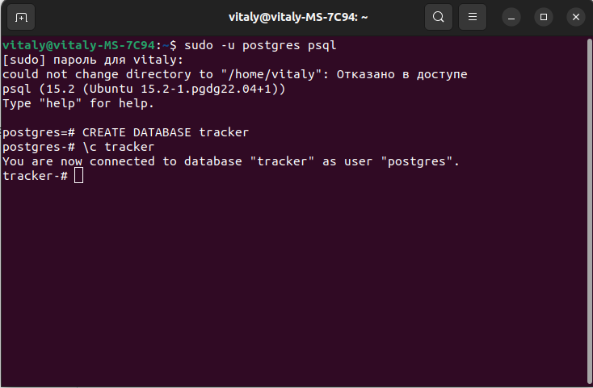

# job4j_tracker

## Использованные технологии
* Liquibase
* Collections Framework
* PostgreSQL
* JDBC
* JUnit 
* Mockito
* h2

## Требование к окружению
* Apache maven 3.8
* Java 17
* PostgresSQL 15

## О проекте

Проект представляет консольное приложение с системой заявок. Исходный код располагается в пакете ru.job4j.tracker, где 
главный класс - StartUI, все данные находятся в бд POSTGRESQL, взаимодействие с бд 
осуществляется с помощью JDBC.

Взаимдействие с приложением:

1. Добавлять заявку. (Create a new item)

1. Заменять заявку на новую заявку по ID. (Edit item)

1. Удалять заявку по ID. (Delete item)

1. Найти заявку по ID. (Find item by Id)

1. Отображать список всех заявок. (Show all items)

1. Производить поиск по имени заявки. (Find items by name)

## Запуск проекта

1. Установить JDK 17 
2. Установить 
3. Установить сервер бд PostgreSQL, при установке задать имя пользователя - postgres, пароль - postgres
порт - 5432
4. Создать БД tracker и подключиться к ней

5. 