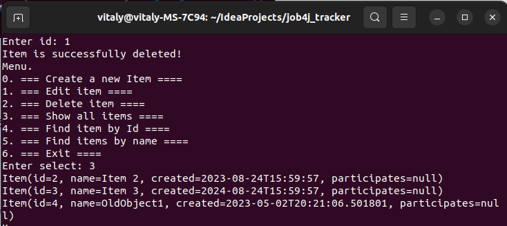

# Проект - Трекер

## Использованные технологии
* Liquibase
* Collections Framework
* PostgreSQL
* JDBC
* JUnit 
* Mockito
* h2

## Требование к окружению
* Apache maven 3.8
* Java 17
* PostgresSQL 15
* Docker
* Docker-compose

## О проекте

Проект представляет консольное приложение с системой заявок. Исходный код располагается в пакете ru.job4j.tracker, где 
главный класс - StartUI, все данные находятся в бд POSTGRESQL, взаимодействие с бд 
осуществляется с помощью JDBC.

Взаимдействие с приложением:

1. Добавлять заявку. (Create a new item)

1. Заменять заявку на новую заявку по ID. (Edit item)

1. Удалять заявку по ID. (Delete item)

1. Найти заявку по ID. (Find item by Id)

1. Отображать список всех заявок. (Show all items)

1. Производить поиск по имени заявки. (Find items by name)

## Запуск проекта (Docker)

1. Установить Docker
2. Установить Docker-compose
3. Через терминал перейти в папку с проектом<br><br>

4. Ввести команду
```shell
docker-compose build
```

5. С помощью команды поднять базу данных<br><br>
```shell
docker compose up db
```

6. С помощью команды запустить приложение <br><br>
```shell
docker-compose run job4j_tracker
```


## Взаимодействие с проектом
* Для того чтобы создать новый объект (заявку), необходимо ввести 0 
и указать имя.

* Для изменения имени объекта, необходимо ввести 1 и указать ID объекта,
затем переименовать.

* Для удаления объекта необходимо ввести 2 и указать ID

* Для вывода на экран всех существующих объектов необходимо ввести 3

* Для поиска и вывода на экран объекта по ID необходимо ввести 4 и указать ID

* Для поиска и вывода на экран объекта/ов по имени необходимо ввести 5 и указать 
имя объекта


## Контакты
vithag97@mail.ru<br>